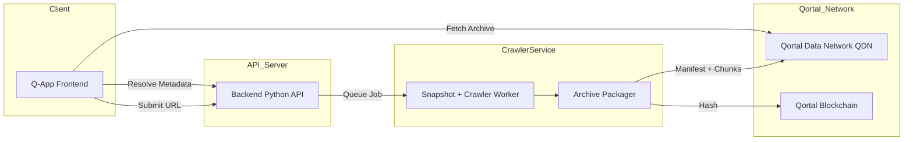
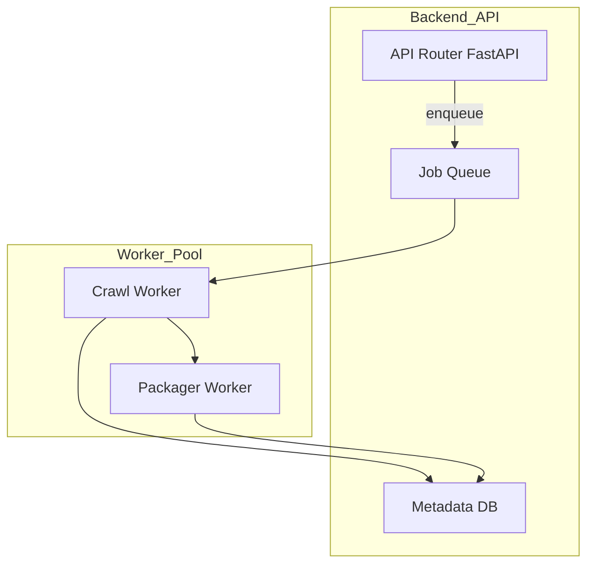
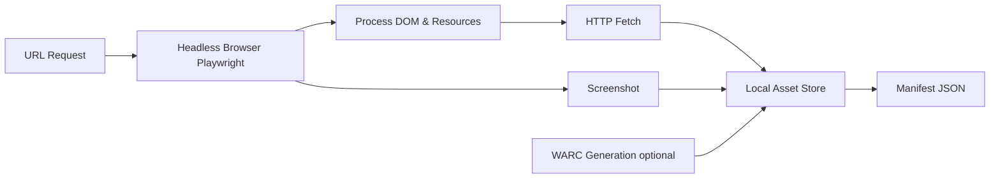
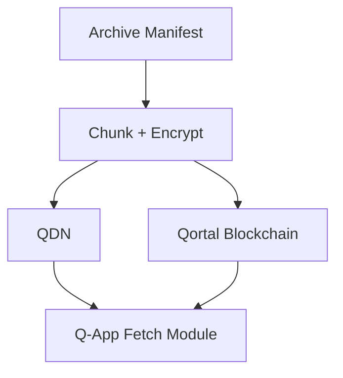
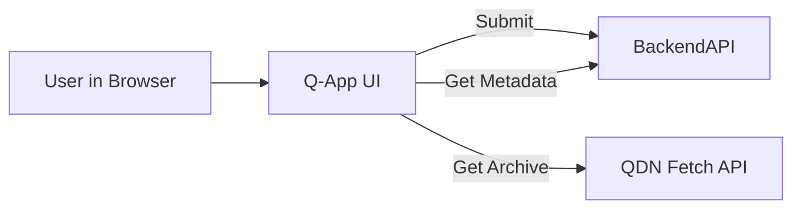

# High Level System Architecture

Diagram shows the major components and how they inter-connect.

# Backend Subsystem Breakdown

Diagram focuses on internal components of the Python backend and how they relate.

# Crawler + Archival Subsystem

Diagram detailes flow for generating snapshots

# Qortal Integration Flow

Diagram shows how packaging and QDN interaction works

# Q-App Frontend Flow

Diagram outlines user interactions via the decentralized frontend

