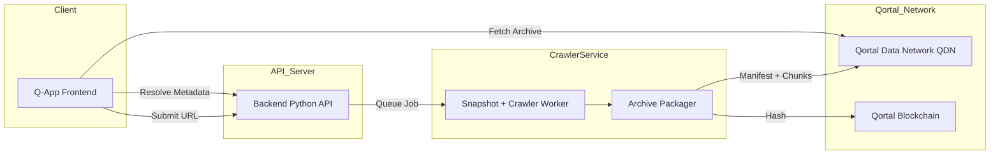
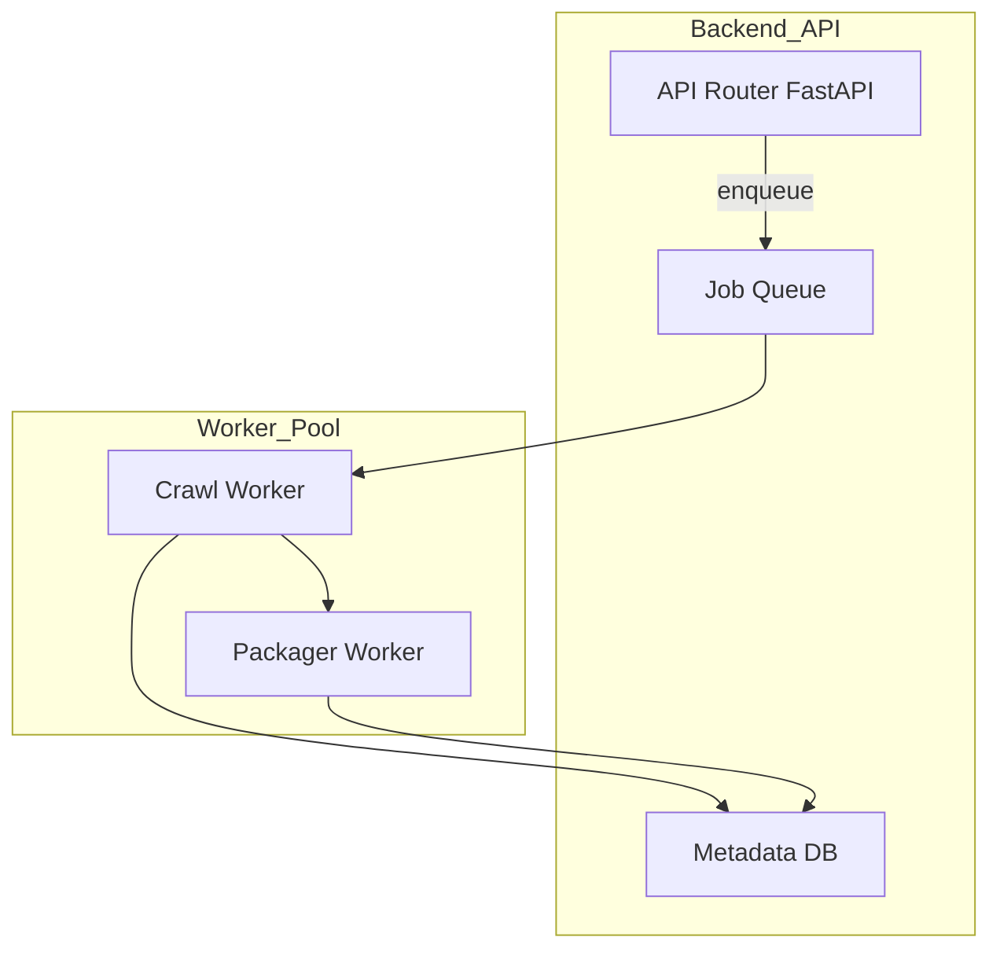
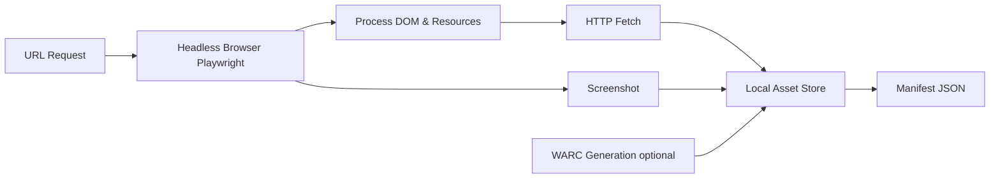
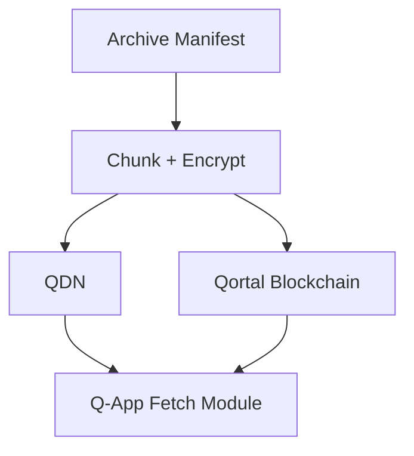
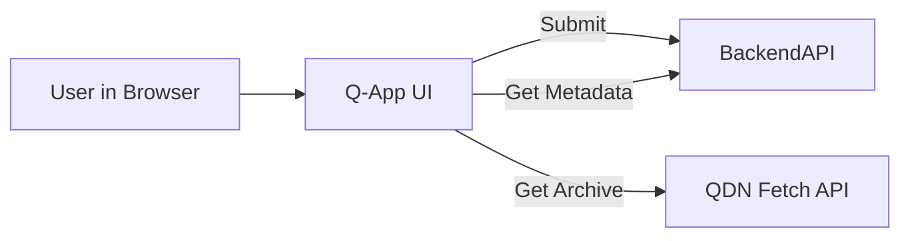

🏗️ BIG-DIG-HEAP

BIG-DIG-HEAP is a decentralized web archiving platform that enables users to capture, store, and retrieve high-fidelity snapshots of web content — powered by a Python backend and the Qortal decentralized network. Think archive.is meets decentralized storage: a resilient archive of web pages that lives on a peer-to-peer data network rather than centralized servers.

🚀 Overview

BIG-DIG-HEAP lets you:

📌 Submit live web URLs for archiving

📦 Store rendered snapshots (HTML, assets, screenshots, and optional WARC)

🔗 Publish archive manifests on the Qortal Data Network (QDN)

🌐 Retrieve snapshots via a decentralized Q-App frontend

📊 Track archive status and metadata through a RESTful API

“Dig deep into history — and keep it safe forever.”

🧠 Motivation

The modern web is ephemeral. Pages disappear or change without notice, yet many contain content we want preserved. Traditional archival systems are centralized and depend on single entities. BIG-DIG-HEAP moves archiving into a decentralized realm, leveraging Qortal’s blockchain and distributed storage to make archives resilient, censorship-resistant, and verifiable.

🧩 Architecture

BIG-DIG-HEAP consists of:

🔹 Crawler Subsystem

A Python service (using Playwright) that:

Renders dynamic web pages

Captures HTML, screenshots, and optionally WARC files

Produces archive manifests and asset bundles

🔹 Backend API

A FastAPI service that:

Accepts archive requests

Queues crawl jobs

Reports status and metadata

Orchestrates packaging and publishing

🔹 Qortal Bridge

A module that:

Publishes archive manifests to Qortal

Uploads chunks to QDN

Records immutable references on the blockchain

🔹 Q-App Frontend

A lightweight JavaScript Qortal App that:

Lets users submit URLs for archiving

Displays status and snapshot history

Fetches archived content from decentralized storage

📦 Features

⭐ High-fidelity snapshots
✔ Full page HTML
✔ Screenshots
✔ Optional WARC (standard archive format)

🔐 Decentralized storage
✔ Manifest hashes on Qortal blockchain
✔ Content served by QDN

⚙️ Developer-friendly API
✔ REST endpoints
✔ Async job queue
✔ Metadata and retrieval

📱 Q-App integration
✔ Simple UI for users
✔ Native Qortal publishing and retrieval

🛠️ Getting Started
Prerequisites

Python 3.10+

Node.js & NPM

Docker (optional)

Qortal Core or access to Qortal API

Quick Start

Clone the repo

git clone https://github.com/yourusername/big-dig-heap.git
cd big-dig-heap


Launch development environment

docker compose up --build


Access services

Backend API: http://localhost:8000

Q-App UI: http://localhost:8080

API docs: http://localhost:8000/docs

```
📁 Project Structure
/
├─ backend/        # FastAPI REST API
├─ crawler/        # Python snapshot & crawler logic
├─ qortal/         # Bridge to Qortal publishing
├─ qapp/           # Q-App frontend
├─ docker-compose.yml
├─ README```.md
```

🧪 Usage Examples
Submit a URL for Archiving
```
curl -X POST http://localhost:8000/archive \
     -H "Content-Type: application/json" \
     -d '{"url":"https://example.com"}'
```
Check Job Status
```
curl http://localhost:8000/archive/<JOB_ID>
```

🧠 How It Works

User submits a URL via the Q-App or REST API.

Backend queues a crawl job.

Crawler fetches and renders the page, then packages assets.

Archive manifest is generated and hashes computed.

Manifest uploaded to QDN; hashes committed to Qortal blockchain.

Snapshots can be retrieved via the Q-App or direct fetch from QDN.

💡 Contributing

Contributions are welcome! Feel free to:

Improve crawler fidelity

Add search or indexing

Expand Q-App UI features

Harden job scheduling and retries

📜 License

This project is released under the MIT License — see LICENSE for details.

🪙 Acknowledgements

BIG-DIG-HEAP was inspired by open archival tools and decentralized storage innovations.


# TECHNICAL REFERENCE

🧠 Understanding the Key Concepts

1️⃣ What Qortal Provides

Blockchain + Data Network (QDN): Qortal’s QDN lets you store encrypted, chunked data in a peer-to-peer network secured by the blockchain. 
Qortal

Publishing Websites & Apps: Qortal supports publishing websites and apps (Q-Apps) that are hosted decentralized, fee-less and indefinitely. 
wiki.qortal.org

Q-Apps API: JavaScript-based apps can interact with users and the blockchain through Qortal’s APIs, making it usable with modern front-ends. 
Qortal

BIG-DIG-HEAP app will likely be a architecture — a crawler running on backend servers to fetch and snapshot web content, plus a Q-App frontend that interacts with Qortal for storage, retrieval, and distribution.

# High Level System Architecture

Diagram shows the major components and how they inter-connect.


# Backend Subsystem Breakdown

Diagram focuses on internal components of the Python backend and how they relate.



# Crawler + Archival Subsystem

Diagram detailes flow for generating snapshots



# Qortal Integration Flow

Diagram shows how packaging and QDN interaction works



# Q-App Frontend Flow

Diagram outlines user interactions via the decentralized frontend


