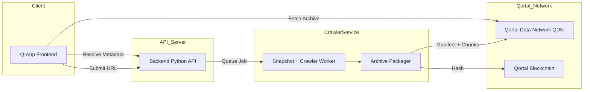
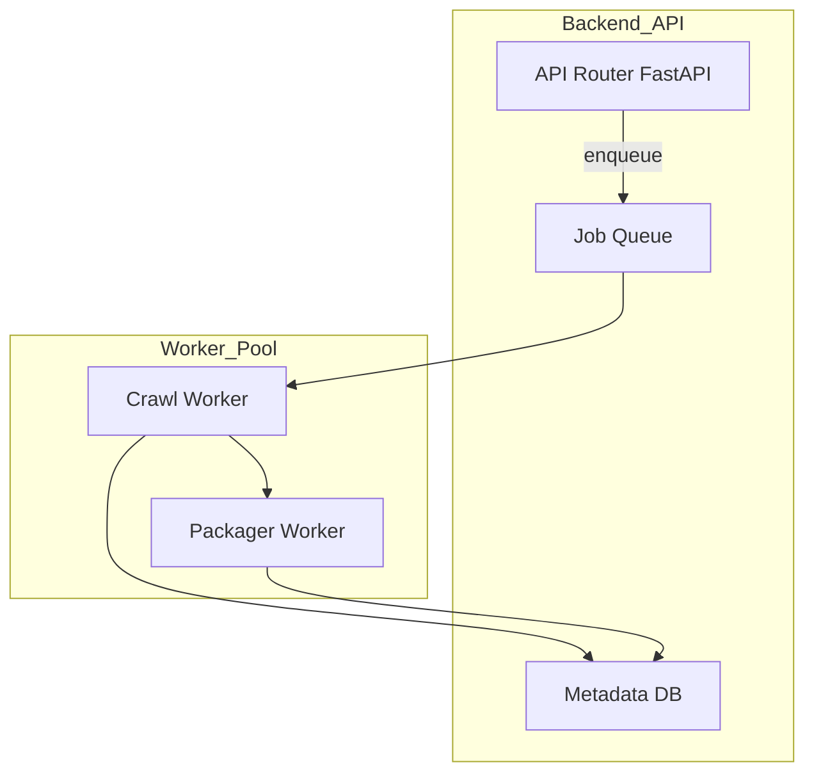
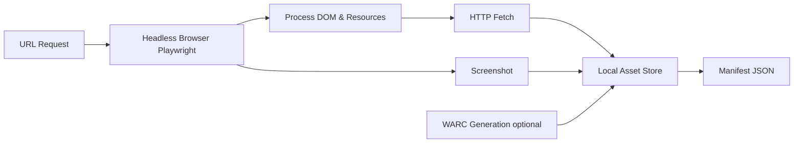
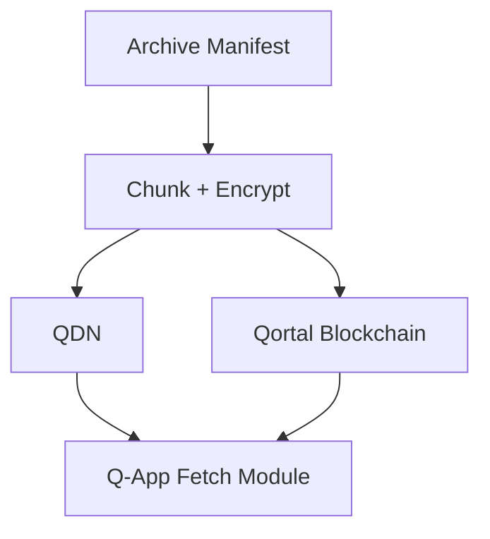
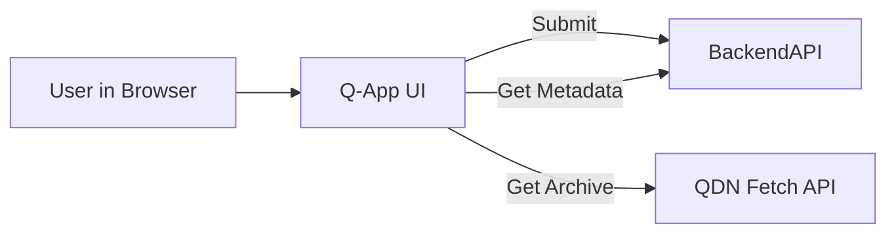

🏗️ BIG-WEB-ARCHIVE

BIG-WEB-ARCHIVE is a decentralized web archiving platform that enables users to capture, store, and retrieve high-fidelity snapshots of web content — powered by a Python backend and the Qortal decentralized network. Think archive.is meets decentralized storage: a resilient archive of web pages that lives on a peer-to-peer data network rather than centralized servers.

🚀 Overview

BIG-WEB-ARCHIVE lets you:

📌 Submit live web URLs for archiving

📦 Store rendered snapshots (HTML, assets, screenshots, and optional WARC)

🔗 Publish archive manifests on the Qortal Data Network (QDN)

🌐 Retrieve snapshots via a decentralized Q-App frontend

📊 Track archive status and metadata through a RESTful API

“Dig deep into history — and keep it safe forever.”

🧠 Motivation

The modern web is ephemeral. Pages disappear or change without notice, yet many contain content we want preserved. Traditional archival systems are centralized and depend on single entities. BIG-WEB-ARCHIVE moves archiving into a decentralized realm, leveraging Qortal’s blockchain and distributed storage to make archives resilient, censorship-resistant, and verifiable.

📦 Features

* High-fidelity snapshots
  * Full page HTML
  * Screenshots (.png)
  * WARC (standard web archive format)

* Decentralized storage
  * Manifest hashes on Qortal blockchain
  * Content served by QDN

* Developer-friendly API
  * REST endpoints
  * Async job queue
  * Metadata and retrieval

* Q-App integration
  * Simple UI for users
  * Native Qortal publishing and retrieval

🧩 Architecture

BIG-WEB-ARCHIVE consists of:

* Crawler Subsystem
  * A Python service (using Playwright) that:
  * Renders dynamic web pages
  * Captures HTML, screenshots, and optionally WARC files
  * Produces archive manifests and asset bundles

* Backend FastAPI
  * Accepts archive requests
  * Queues crawl jobs
  * Reports status and metadata
  * Orchestrates packaging and publishing

* Qortal Bridge
  * Publishes archive manifests to Qortal
  * Uploads chunks to QDN
  * Records immutable references on the blockchain

* Q-App lightweight JavaScript Qortal App Frontend
  * Lets users submit URLs for archiving
  * Displays status and snapshot history
  * Fetches archived content from decentralized storage

---

🛠️ Getting Started

* Prerequisites
  * Python 3.10+
  * Node.js & NPM
  * Docker (optional)
  * Qortal Core or access to Qortal API

🛠️ Quick Start

<!-- * Clone the qortal repo

```
git clone https://github.com/Qortal/qortal.git
cd qortal
```
* Build the .jar with Maven
```
mvn clean package
cd ..
``` -->
  * Clone the big-web-archive repo  
```
git clone https://github.com/8bittengeek/big-web-archive.git
cd big-web-archive
```
  <!-- * Get the Qortal core
```
cp ../qortal/target/qortal-5.0.6.jar ./
``` -->
  * Build a local image
```
docker build -t qortal-bdd-image .
```
  * Launch development environment
```
docker compose up --build
```
  * Access services
  
Backend API: `http://localhost:8000`

Q-App UI: `http://localhost:62391`

API docs: `http://localhost:8000/docs`

---

📦 BIG-WEB-ARCHIVE Docker Setup Overview

* This provides a consistent dev environment using containers so you can:
  * Run your backend API and crawler in isolated containers
  * Optionally run a local Qortal node (blockchain + QDN)
  * Preview your Q‑App frontend
  * Spin everything up with one command

⚠️ Important Note on Qortal Core:
Qortal Core doesn’t currently publish an official Docker image; it’s designed to run as a Java application built from source. If you want a local node in Docker, you’ll need to build your own container image from the repo or use an external dev script to wrap it. 

The composition below includes a placeholder qortal_node service that expects your own image (big-dig-DEEP‑image). You can replace it with your own custom build once available.

```
📁 Project Structure
/
├─ backend/        # FastAPI REST API
  ├── api.py
  └── Dockerfile
├─ crawler/        # Python snapshot & crawler logic
  └── crawler.py
├─ qortal/         # Bridge to Qortal publishing
  └── bridge.py
├─ qapp/           # Q-App frontend
  ├── index.html
  ├── app.js
  ├── styles.css
  ├── qapp.json
  └── Dockerfile
├─ docker-compose.yml
├─ Dockerfile
├─ LIENSE.md
└─ README.md
```

🧪 Usage Examples
Submit a URL for Archiving
```
curl -X POST http://localhost:8000/archive \
     -H "Content-Type: application/json" \
     -d '{"url":"https://example.com"}'
```
Check Job Status
```
curl http://localhost:8000/archive/<JOB_ID>
```
---

* How It Works
  * User submits a URL via the Q-App or REST API.
  * Backend queues a crawl job.
  * Crawler fetches and renders the page, then packages assets.
  * Archive manifest is generated and hashes computed.
  * Manifest uploaded to QDN; hashes committed to Qortal blockchain.
  * Snapshots can be retrieved via the Q-App or direct fetch from QDN.


---

* Big Web Archive - UI
  * Submit new crawl/archive jobs
  * Show job queue + status
  * Surface archive results (hashes, QDN refs later)
  * Feel trustworthy, technical, not “Web2 glossy”

```
┌──────────────────────────────┐
│ Big Web Archive              │
│ Identity: <Qortal name>      │
├──────────────────────────────┤
│ [ New Crawl Job ]            │
│  URL: [___________________]  │
│  Depth: [ 1 ▼ ]              │
│  Media: [✓] HTML [✓] Assets  │
│  [ Submit Job ]              │
├──────────────────────────────┤
│ Active / Recent Jobs         │
│ ┌──────────────────────────┐ │
│ │ job_id  status  progress │ │
│ │ job_id  done    100%     │ │
│ └──────────────────────────┘ │
├──────────────────────────────┤
│ Job Output / Logs            │
│ ┌──────────────────────────┐ │
│ │ crawler stdout / results │ │
│ └──────────────────────────┘ │
└──────────────────────────────┘
```

---

* Contributions are welcome! Feel free to:
  * Improve crawler fidelity
  * Add search or indexing
  * Expand Q-App UI features
  * Harden job scheduling and retries

---

📜 License

This project is released under the MIT License — see [LICENSE.md](LICENSE.md) for details.

🪙 Acknowledgements

BIG-WEB-ARCHIVE was inspired by open archival tools and diligent archivists everywhere.

---

# TECHNICAL DESIGN NOTES

🧠 Understanding the Key Concepts

* What Qortal Provides
  * Blockchain + Data Network (QDN): Qortal’s QDN lets you store encrypted, chunked data in a peer-to-peer network secured by the blockchain. 
  * Publishing Websites & Apps: Qortal supports publishing websites and apps (Q-Apps) that are hosted decentralized, fee-less and indefinitely. 
  * Q-Apps API: JavaScript-based apps can interact with users and the blockchain through Qortal’s APIs, making it usable with modern front-ends. 
  * BIG-WEB-ARCHIVE app consists of a crawler running on backend servers to fetch and snapshot web content, plus a Q-App frontend that interacts with Qortal for storage, retrieval, and distribution.

---

* Crawler & Archival Backend
  * Accepts a URL to archive
  * Fetches the page (headless browser or HTTP fetch)
  * Renders dynamic content with headless browser Playwright
  * Extracts content (HTML, CSS, JS, media, images)
  * Generates snapshots (HTML screenshot, and WARC)
  * Stores metadata (timestamp, hashes, dependencies)
  * This is similar in intent to ArchiveBox but tailored to the needs of BIG-WEB-ARCHIVE.

* Chunking & Storage Module. Because Qortal’s Data Network can store encrypted, chunked data, BIG-WEB-ARCHIVE:
  * A component to chunk archived data
  * Compute content hashes
  * Build a manifest describing the archive snapshot
  * Publish a hash manifest transaction to Qortal so others can fetch and validate content. 
  * This step bridges archiving logic with Qortal’s decentralized storage layer.

* Q-App Frontend. Develop a Q-App (JavaScript with a modern UI framework like React or Svelte) that:
  * Lets users submit URLs to be archived
  * Shows archival status and versions
  * Lists archived snapshots with metadata
  * Fetches archived content using QDN’s decentralized fetch APIs
  * The Q-App would interact with BIG-WEB-ARCHIVE backend (crawler) and Qortal to coordinate storage and retrieval.

* Security, Integrity & Versioning
  * Every archived snapshot should include cryptographic hashes.
  * Storing hashes in the blockchain gives immutable proof of content versioning.
  * Consider formats like WARC, HTML + resource bundles, and even screenshots for extra fidelity.
  * These patterns are widely used in the archival community because they help with verifiability and replay accuracy.

---

📈 Development Technologies

| Component	| Suggested Stack |
| --------- | --------------- |
| Crawler / Scraper	Puppeteer/Playwright (JS) or Headless Chrome / Chrome DevTools Protocol
| Backend API |	Python (FastAPI) |
| Archival Storage Format | WARC, HTML Bundles, PDF, Screenshots |
| Q-App Frontend | JavaScript + React / Svelte, Q-Apps API |
| Deployment | Docker for crawler service |

---

# High Level System Architecture

Diagram shows the major components and how they inter-connect.


# Backend Subsystem Breakdown

Diagram focuses on internal components of the Python backend and how they relate.



# Crawler + Archival Subsystem

Diagram detailes flow for generating snapshots



# Qortal Integration Flow

Diagram shows how packaging and QDN interaction works



# Q-App Frontend Flow

Diagram outlines user interactions via the decentralized frontend


